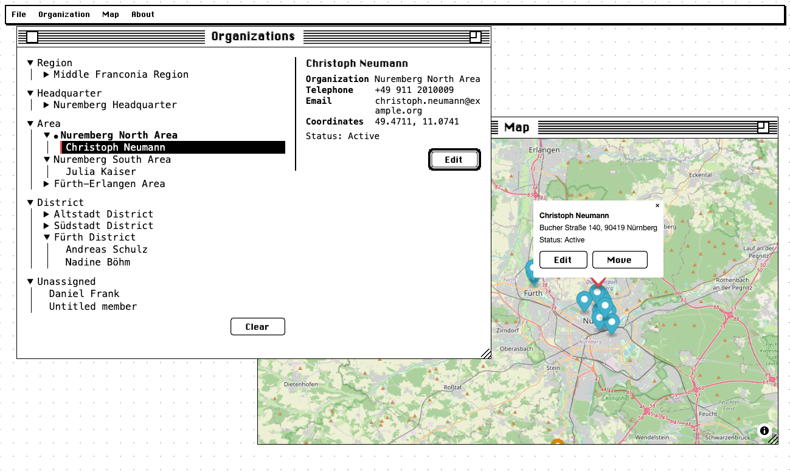

[](https://github.com/cowglow/visual-directory/actions/workflows/deploy.yml)
[](https://github.com/cowglow/visual-directory/actions/workflows/test.yml)

# Visual Directory

A map-based contact directory for leadership organizations: leaders add members by
clicking their location on the map, assign them to organizations, mark lost contact,
and see distance between members. See `docs/PLAN.md` for the full product plan and
`docs/USER_MANUAL.md` for how to actually use the app.



## Repo layout

- **`src/`** — the frontend: React + TypeScript + Vite, deployed as a static site to
  GitHub Pages. Talks to the backend only over its REST API. See `CLAUDE.md` for the
  architecture (it's mid-migration to a layered domain/application/infrastructure/
  ports structure).
- **`server/`** — the backend: Node/Express + Prisma + Postgres. A separate,
  independently deployable service — not a workspace member of the frontend.
- **`e2e/`** — Playwright end-to-end tests driving the real frontend against the real
  backend. See `e2e/README.md`. Every push to `main` runs the frontend/server unit
  tests and this e2e suite via `.github/workflows/test.yml` and publishes a combined
  report to [cowglow.github.io/visual-directory/test-report/](https://cowglow.github.io/visual-directory/test-report/).
- **`docs/`** — `PLAN.md` (the product plan), `CLEAR_ARCHITECTURE.md` (the frontend's
  architectural style), `PHASE_*_REPORT.md` (what was built in each phase and how it
  was verified), `USER_MANUAL.md`, `HETZNER_DEPLOY.md` (production deployment guide).

## How the frontend is hosted

The frontend is a static site — there's no Node server involved in production at all.
`vite build` compiles `src/` into plain HTML/CSS/JS in `dist/`, and that's served
directly by **GitHub Pages** from the `gh-pages` branch of this repo.

That branch is kept up to date automatically by `.github/workflows/deploy.yml`: every
push to `main` runs `pnpm install && pnpm build`, then
[`JamesIves/github-pages-deploy-action`](https://github.com/JamesIves/github-pages-deploy-action)
force-pushes the contents of `dist/` to `gh-pages`, which is the branch GitHub Pages is
configured to serve from. There's no separate deploy step to run by hand — merging to
`main` is the deploy. The badge at the top of this README links to that workflow's run
history.

Because it's a static export, the frontend never talks to a database directly — it
only calls the backend's REST API, at whatever URL `VITE_API_URL` was set to when it
was built (baked in at build time, since Vite env vars aren't read at runtime). Locally
that's `http://localhost:4000` (see `.env.example`); in the deployed build it points at
wherever the backend is actually deployed (see `docs/HETZNER_DEPLOY.md` step 8).

The backend (`server/`, Postgres + the API) is **not** part of this static deploy — it
runs separately, containerized, wherever you choose to host it (see
[Running the backend in Docker](#running-the-backend-in-docker-for-development) and
[Deploying the backend](#deploying-the-backend-with-docker) below).

## Quick start

Frontend only (map UI, no login/backend features will work):

```bash
pnpm install
pnpm dev
```

Full stack, for anything involving login, members, or organizations — one-time setup
(see [Running the backend in Docker](#running-the-backend-in-docker-for-development)
below for what these do), then a single command to boot everything day-to-day:

```bash
cp .env.example .env               # VITE_API_URL should point at the backend
cd server && cp .env.example .env && cd ..
pnpm backend:up
pnpm backend:migrate
SEED_LEADER_EMAIL=you@example.com pnpm backend:seed   # first time only

pnpm dev:all               # backend (already up) + frontend dev server + Storybook, one terminal
```

Magic-link logins are sent via [Resend](https://resend.com) in production
(`RESEND_API_KEY`/`EMAIL_FROM`, see `server/.env.example` and
`docs/HETZNER_DEPLOY.md`). In local/dev environments (`NODE_ENV !== "production"`),
links are logged to the backend's own console instead, so nothing needs a real email
account to test.

## Commands

Frontend (repo root):

```bash
pnpm dev          # start dev server
pnpm dev:all      # backend up + dev server + Storybook together, one terminal (see below)
pnpm build        # tsc && vite build
pnpm lint         # eslint src e2e
pnpm test         # vitest --coverage (unit tests)
pnpm test:e2e     # playwright test (requires the backend running — see e2e/README.md)
pnpm format       # prettier . --write
pnpm docker:dev   # open a shell in a containerized frontend dev environment (see below)

pnpm backend:up       # docker compose up -d db api adminer
pnpm backend:down     # docker compose down
pnpm backend:logs     # tail the api container's logs
pnpm backend:migrate  # apply pending Prisma migrations inside the api container
pnpm backend:seed     # bootstrap the first leader account (SEED_LEADER_EMAIL=... pnpm backend:seed)
```

Backend (`server/`):

```bash
pnpm dev              # tsx watch src/index.ts
pnpm build            # tsc
pnpm prisma:migrate   # create a new migration (dev)
pnpm prisma:deploy    # apply existing migrations
pnpm seed             # bootstrap the first leader account (SEED_LEADER_EMAIL=...)
pnpm test             # vitest run
```

## Docker

There are two independent Docker setups in this repo, defined together in the one
`docker-compose.yml` at the root:

- **`frontend`** — an _optional_, containerized shell for running the Vite dev server
  itself, in case you'd rather not install Node/pnpm on your host at all. Nothing about
  the frontend's actual deploy uses this container (see
  [How the frontend is hosted](#how-the-frontend-is-hosted) above) — it exists purely
  as a convenience for local development.
- **`db` + `api` (+ `adminer`)** — the real backend stack: Postgres, the Express/Prisma
  API, and a database admin UI. This is what actually needs Docker, for local dev and
  for the Hetzner production deploy alike.

Both need Docker Desktop (or another Docker Engine) running locally first.

### Running the backend in Docker (for development)

From the repo root:

```bash
cd server
cp .env.example .env               # dev defaults are fine locally, edit if you need to
cd ..
pnpm backend:up
```

This builds the `api` image (see `server/Dockerfile` — a two-stage build that compiles
the TypeScript and runs Prisma's client generation, then a slim production-style image
that just runs `node dist/index.js`) and starts three containers:

| Container                  | Service   | Port                 |
| -------------------------- | --------- | -------------------- |
| `visual-directory-db`      | `db`      | `5432` (Postgres)    |
| `visual-directory-api`     | `api`     | `4000` (REST API)    |
| `visual-directory-adminer` | `adminer` | `8081` (DB admin UI) |

Then run migrations and seed the first leader account (only needed once, or after a
schema change):

```bash
pnpm backend:migrate
SEED_LEADER_EMAIL=you@example.com pnpm backend:seed
```

Confirm it's up:

```bash
curl http://localhost:4000/health
# {"ok":true}
```

Adminer (a Postgres web UI) is now reachable at `http://localhost:8081` — use
`db` / the `POSTGRES_USER`/`POSTGRES_PASSWORD`/`POSTGRES_DB` values from
`docker-compose.yml` (defaults: `app` / `app` / `contact_book`) to log in.

Now point the frontend at it and start it (on your host, not in Docker — see below for
why):

```bash
cp .env.example .env               # VITE_API_URL=http://localhost:4000 by default
pnpm dev
```

Or, once the one-time setup above is done, `pnpm dev:all` brings the backend up (if
not already) and runs the frontend dev server and Storybook together in one terminal.

Useful day-to-day commands:

```bash
pnpm backend:logs            # tail API logs
pnpm backend:down            # stop everything (keeps the Postgres volume)
docker compose down -v       # stop everything AND wipe the Postgres volume
```

### Running the frontend in Docker (optional)

The frontend normally just runs on your host via `pnpm dev` — that's what
`.github/workflows/deploy.yml` and every doc above assumes, and it's the simpler path.
The `frontend` service exists only if you'd rather do all of that inside a container
(e.g. to avoid installing a specific Node version locally). It's a plain `node:22`
image with the repo bind-mounted in, not a prebuilt dev server — `pnpm install`/
`pnpm dev` get run manually once you're inside it.

```bash
pnpm docker:dev
# equivalent to: docker compose run --service-ports frontend bash
```

That drops you into a shell inside the container, with the repo mounted at `/app`.
From there:

```bash
pnpm install
pnpm dev            # or `pnpm storybook`, `pnpm build && pnpm preview`
```

`--service-ports` publishes the ports declared in `docker-compose.yml` (`3000` for
`pnpm dev`, `6006` for Storybook, `4173` for `pnpm preview`) to your host, so
`https://localhost:3000` works the same as running natively.

One important detail baked into `docker-compose.yml`: the `frontend` service mounts
`.:/app` (your whole repo) plus a separate anonymous volume at `/app/node_modules`.
That second mount matters — without it, `pnpm install` inside the Linux container would
install Linux-native binaries (esbuild, rollup, etc.) _through_ the bind mount and
overwrite your host's `node_modules`, breaking `pnpm dev` on macOS/Windows the next
time you ran it outside Docker. The anonymous volume keeps the container's
`node_modules` separate from your host's, at the cost of it not persisting between
separate `docker compose run` invocations — install once per session, not once ever.

### Deploying the backend with Docker

The frontend deploys automatically to GitHub Pages on every push to `main` (see
[How the frontend is hosted](#how-the-frontend-is-hosted)) — there's nothing to do by
hand there. The backend has no CI/CD by design (per `docs/PLAN.md`); it's deployed
manually with the same `docker-compose.yml` used for local dev, on a Hetzner Cloud VPS.

Short version:

```bash
ssh deploy@YOUR_SERVER_IP
cd ~/app
git pull
docker compose up -d --build db api caddy   # caddy fronts api with HTTPS; see full guide
docker compose exec api pnpm prisma:deploy  # only if there are new migrations
```

The full walkthrough — provisioning the server, firewall rules, production `.env`
values, adding the Caddy reverse proxy for TLS, wiring `VITE_API_URL` into the frontend
build so it points at the real API, backups, and day-2 operations — is in
[`docs/HETZNER_DEPLOY.md`](docs/HETZNER_DEPLOY.md). Follow that end to end the first
time; the snippet above is just the shape of a routine redeploy afterwards.

## Deploying

Frontend deploys automatically to GitHub Pages on push to `main`
(`.github/workflows/deploy.yml`) — see [How the frontend is hosted](#how-the-frontend-is-hosted).
Backend deployment is manual — see [Deploying the backend with Docker](#deploying-the-backend-with-docker)
and `docs/HETZNER_DEPLOY.md`.
